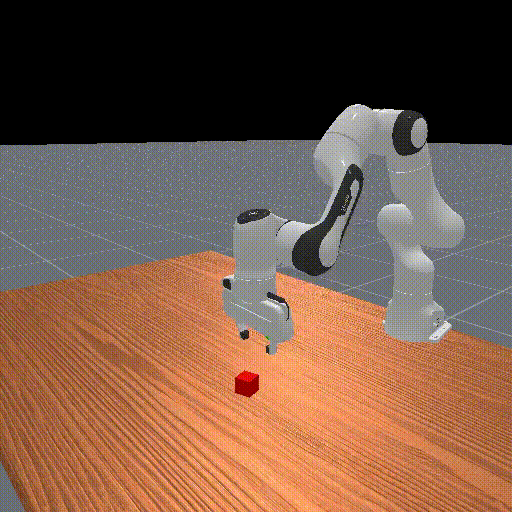
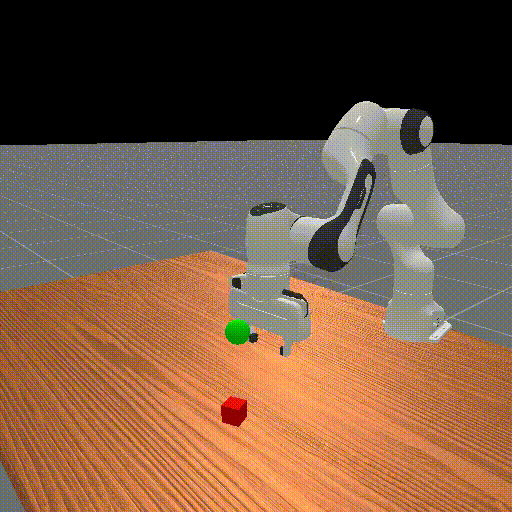

# 手撕 ACT 算法并在 Bigym 和 ManiSkill 仿真器训练/验证/测试






## 1. Why

### Q: 为什么要手撕这个代码？

我确实知道有现成的开源代码或项目完成了对 ACT 的复现，但是考虑自己所在实验室目前的现状，手撕一份简单一点的、可以上手单步调试的 ACT 代码是有益的：可以大致了解模仿学习模型结构、数据集规模和训练体量；了解模仿学习存在哪些改进空间；以及思考扩展到 VLA 的可能性。

### Q: 为什么选择 Bigym ？

这个仿真环境建模了人形机器人 H1 和一些交互任务，且仿真环境也提供了很多人类采集的数据。Bigym 论文中对 ACT 做了测评，可以通过论文的数值进行对标自己的代码。同时这个 Bigym 也被 2024 年的 CoRL 会议接受了。

### Q: 为什么选择 ManiSkill ？

之前就了解了这个仿真器，提供了比较多了机械臂、四足狗甚至模仿学习的演示数据集，因此在后面额外增加在 ManiSkill 上的模仿学习，整合成了新的 repo 。

## 2. 参考资料

 - ACT 原始论文，在论文正文和附录里面讲的很清楚了，[链接](https://arxiv.org/pdf/2304.13705#page=8.86)。
 - Bigym 原始论文，[arxiv链接](https://arxiv.org/abs/2407.07788)，[OpenReview 情况](https://openreview.net/forum?id=EM0wndCeoD)。
 - ManiSkill 的[GitHub 项目页面](https://github.com/haosulab/ManiSkill/tree/main)和[技术文档](https://maniskill.readthedocs.io/en/latest/user_guide/getting_started/quickstart.html)所示。

## 3. 安装

### 基本 conda 虚拟环境搭建

```commandline
conda create -n rl310 python=3.10
```

### Bigym 安装

进入 Bigym 的 GitHub 项目主页中根据安装教程安装 Bigym 包即可，[跳转链接](https://github.com/chernyadev/bigym)。

返回到主目录中，克隆项目并进入项目内安装依赖包。

### ManiSkill 安装

进入 ManiSkill 的技术文档的[安装教程](https://maniskill.readthedocs.io/en/latest/user_guide/getting_started/installation.html)中安装即可。

### ACT_Implementation 安装

```commandline
cd ~
```
```commandline
git clone https://github.com/JinbiaoZhu/ACT_Implementation.git
```
```commandline
cd ACT_Implementation
```
```commandline
pip install -r requirements.txt
```
安装完成后，需要在 *项目主目录* 中创建两个文件夹，用以保存模型权重参数以及渲染的视频：
```commandline
mkdir ./ckpts
mkdir ./videos
```
创建完毕后，就可以跑代码了。如果想使用 Bigym 仿真器训练 ACT ，使用以下命令：

```commandline
python ACT_for_bigym.py
```
如果使用 ManiSkill 仿真器训练 ACT ，使用以下命令：

```commandline
python ACT_for_Maniskill.py
```

关于实验、模型和算法超参数等都可以在 ```./configs/ACT_bigym_config.yaml``` 和 ```./configs/ACT_maniskill_config.yaml``` 中进行修改。

> 注意：本项目使用 Wandb 作为训练过程记录器，常规 Wandb 使用需要联网，且需要密钥，请事先准备。

# 4. 一些细节

## 4.1 数据集

  1. 数据集用类似 RL 的 replay buffer 收集的，且**实际项目**或者**真机实验**也可以使用类似的数据结构。
  2. 由于 ACT 算法是未来多个时刻的动作序列做预测，那么在数据集拆分中容易出现溢出情况，也就是：当前数据集样本点索引 + 动作序列长度 > 整个数据集的最大索引。解决方式是对不同的动作类型进行不同数值的填充。如果任务环境/数据集类型是绝对动作值，那么最后填充数据就是数据集最后一个动作向量的复制；如果任务环境/数据集类型是相对动作值（动作增量），那么最后填充数据就是 0 动作向量的复制。
  3. ManiSkill 的任务的数据集是根据 ManiSkill 自己的开源框架移植修改而成：[原始代码](https://github.com/haosulab/ManiSkill/blob/main/examples/baselines/act/act/utils.py)没有对 image-based 的数据集做处理，自己阅读源代码进行了修改。Bigym 是自己设计 replay buffer 收集数据的。

## 4.2 网络结构

1. 设置 ```[CLS]``` token, 原本的做法是：变换成维度是 (1, 1, 1) 的张量, 并构建一个可学习线性层的网络, 将维度 (1, 1, 1) 映射到 (1, 1, d_model) ；还有一种写法是直接将 ```[CLS]``` token 初始化成成维度是 (1, 1, d_model) 的张量；还有另一种写法是使用 `nn.Embedding()` 去初始化这个 ```[CLS]``` token 并使用其 `.weight` 权重来操作。
2. ACT 的网络结构包含三部分：表征编码器、ACT 编码器和 ACT 解码器。其中，表征编码器的编码器层数是一样的。输入至 ACT 网络的数据结构是 (seq_len, batch_size, d_model) ，我之前的写法是 (batch_size, seq_len, d_model) ，然后根据 seq_len 索引想要的位置的张量即可。
3. 网络里面比较重要的是图像处理。ACT 使用的是 ResNet18 模块，这个模块可以将 (batch_size, channels, height, width) 的图像变换成 (batch_size, 512, height // 32, width // 32) ，**注意：在变换完后再进行位置编码！！！**也就是位置编码的维度是 (1, 512, height // 32, width // 32) ，相加时依靠广播机制实现。
4. 网络权重设置如下。我发现按照原始论文中的编码器和解码器的堆叠数量损失函数后期下降很难，考虑到我这里设置的图像输入是单视角 RGB 而不是原始论文中的多视角，且每张图片的大小是 (3, 84, 84) 或者 (3, 128, 128) 分别对于 Bigym 和 Maniskill 而言，而不是实际相机的 (3, 640, 480) ，因此思考合理降低编码器解码器的堆叠数量可以更好拟合监督学习的 scaling law 。
5. 重参数化采样。原本的重参数化采样是 $z = \mu + \sigma \cdot \epsilon$ 其中 $\epsilon$ 是标准正态分布采样得到的。但是看到一些代码是， $\epsilon$ 确实用标准正态分布采样，但是设置成可训练参数，可以随着训练过程进行变化。

## 4.3 训练和测试

1. 在 ```env/make_bigym_envs.py``` 的 ```test_in_simulation``` 函数中，我观察到 ```env.reset()``` 获得的本体数据和图像观测很奇怪，都是 0 ？但是直接将 0 作为输入模型还是可以跑的。

  2. ```step_this_episode >= 999``` 的 999 是自己设置的，因为不成功的情况下机器人会一直奇怪的运动着，设置 999 相当于提前截断了，比较省时间。
  3. 超参数设置如下。原本按照论文的学习率是 1e-5 但是根据自己之前的经验来看似乎 1e-4 到 1e-5 的余弦式下降或者根据训练步数直接下降都更好一些。

# 5. 实验效果

我把一些跑的结果记录到了 Wandb 的项目中，[ Bigym 效果](https://wandb.ai/jbzhu1999/New-ACT-Bigym/overview)和[ Maniskill 效果](https://wandb.ai/jbzhu1999/New-ACT-Maniskill/overview)。

欢迎师弟师妹 clone 这个包然后魔改代码看看在其他任务（甚至非 Bigym / Maniskill 环境上也可以尝试跑跑哦）是否有更好的效果，加油。 

# 6. 施工报告

====> 20250316 中午：修改了 Readme.md 文件。

====> 20250315 晚上：重大更新！！！修改了网络结构、数据集索引等等很多内容！

====> 20250303 中午：代码检查发现在表征编码器部分的 action chunk 没有添加位置编码，现在添加上了

====> 20250302 中午：删除了一些参数, 调整了一些参数, 增加了一些参数注释.

====> 20250301 晚上：我的算法出结果了！它真的可以 Pick Cube !

====> 20250301 下午：调参发现 kl 散度的优化系数太高，导致 kl 散度下降太快导致过拟合 (小于 1e-5 ) 现在修改损失函数让 kl 散度的下降稳定一些。

====> 20250227 晚上：看代码的时候发现处理图片用了 .transpose 方法，会导致图片严重失真，在 ManiSkill 任务上做了修复。

====> 20250227 上午：对代码做了优化：优化 ResNet 18 的调用和梯度计算。

====> 20250226 晚上：吃饭的时候发现我的数据集在截取子序列的时候没有截断，今晚解决了这个 bug ，用 Bigym 环境做训练。

====> 20250226 下午：用自己写的代码、处理好的数据集，按照 ACT 原始论文的配置方式进行模型训练。

====> 20250226 上午：把老板横向项目的 HDF5 数据集做了处理。

====> 20250225 下午：阅读 Bigym 的底层代码知道了 lightweight 数据集怎么转换成带有图片观测的数据，并对代码做了修改。

====> 20250225 上午：按照老板的期望添加了槽注意力模型，槽注意力模型似乎并没有起到很大作用...

====> 20250224 下午：把 Mani-Skill 环境融进我的代码了，跑了几轮效果。
